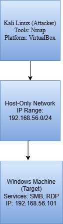

# Cybersecurity Home Lab – Network Reconnaissance Project

## 📌 Project Overview

This project demonstrates the setup and execution of a cybersecurity home lab focused on **network reconnaissance and service enumeration** using Kali Linux. The objective was to simulate real-world penetration testing activities and identify open ports, services, and potential vulnerabilities within a controlled lab environment.

The lab environment was built using **VirtualBox**, with Kali Linux as the attacker machine and a Windows host system as the target.

---

## 🛠 Tools & Technologies Used

* Kali Linux
* Oracle VirtualBox
* Nmap
* SMB Enumeration Tools
* Linux Terminal
* Windows Networking Services

---

## 🌐 Lab Environment Setup

| Component        | Description             |
| ---------------- | ----------------------- |
| Attacker Machine | Kali Linux (VirtualBox) |
| Target Machine   | Windows System          |
| Network Type     | Host-Only Network       |
| Scanner Tool     | Nmap                    |

## 🖥 Network Diagram

The following diagram represents the cybersecurity lab setup used in this project.

---

## 🔍 Scanning Activities Performed

The following reconnaissance techniques were executed:

1. Basic Network Scan
2. Service Version Detection
3. OS Detection
4. Full Port Scan
5. SMB Enumeration
6. Vulnerability Scan
7. Directory Listing Attempts

These scans helped identify:

* Open ports
* Running services
* Operating system information
* SMB configurations
* Potential vulnerabilities

---

## 📂 Project Files Included

* `lab_scan.nmap` – Nmap standard output
* `lab_scan.xml` – XML output
* `lab_scan.gnmap` – Grepable output
* `full_scan.txt` – Full scan results
* `screenshots/` – All scan evidence

---

## 🖼 Screenshots

Screenshots of the scanning process are available in the:

📁 **screenshots/** folder

They document:

* Network discovery
* Service enumeration
* OS detection
* SMB analysis
* Vulnerability scanning

---

## 🧠 Skills Demonstrated

This project demonstrates practical experience in:

* Network Reconnaissance
* Port Scanning
* Service Enumeration
* SMB Enumeration
* Vulnerability Detection
* Linux Command-Line Usage
* Cybersecurity Lab Setup
* Documentation & Reporting

---

## 🎯 Project Objective

The goal of this project was to build hands-on experience in performing reconnaissance activities commonly used in cybersecurity operations, penetration testing, and network security analysis.

---

## 📈 Future Improvements

Planned enhancements include:

* Adding Wireshark packet analysis
* Performing vulnerability exploitation testing
* Creating network diagrams
* Automating scans with scripts

---

## 📄 License

This project is licensed under the MIT License.
