# Screenshots

This folder contains screenshots from the cybersecurity home lab setup and scanning activities.

## Basic Nmap Scan

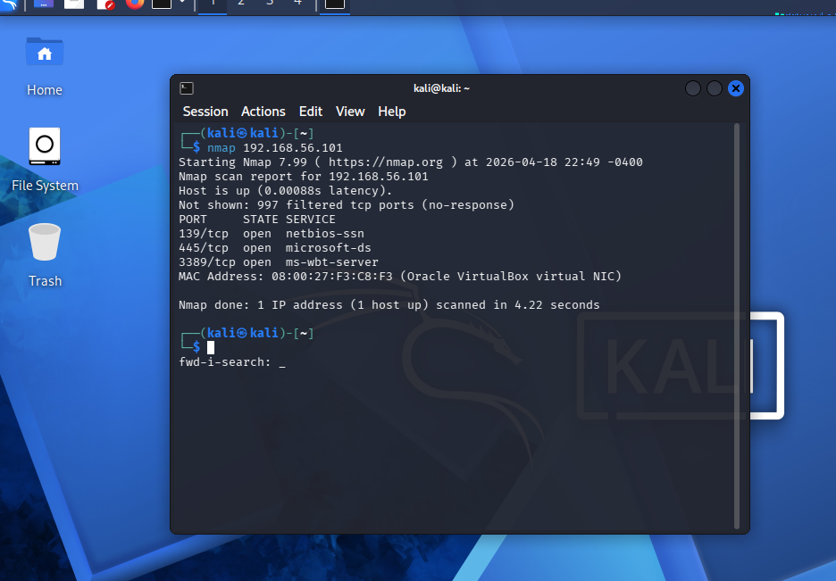

---

## Service Version Detection

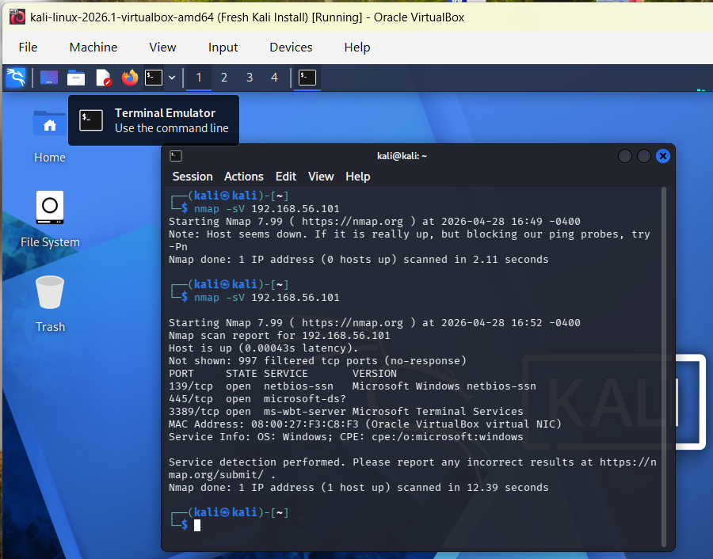

---

## OS Detection

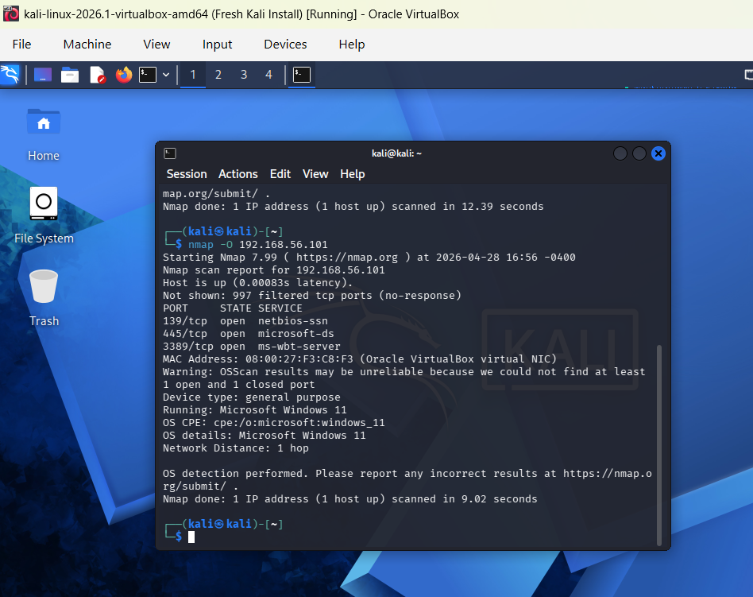

---

## Full Port Scan

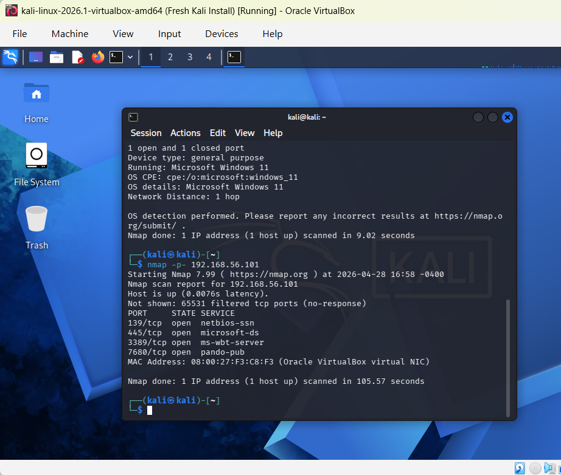

---

## NetBIOS & SMB Information

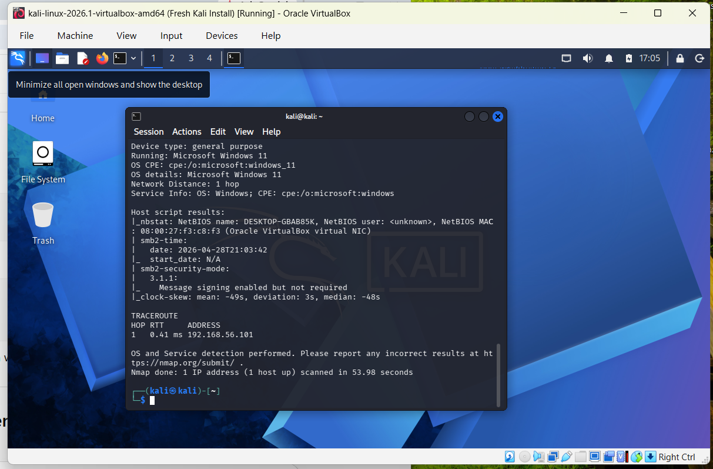

---

## Vulnerability Scan

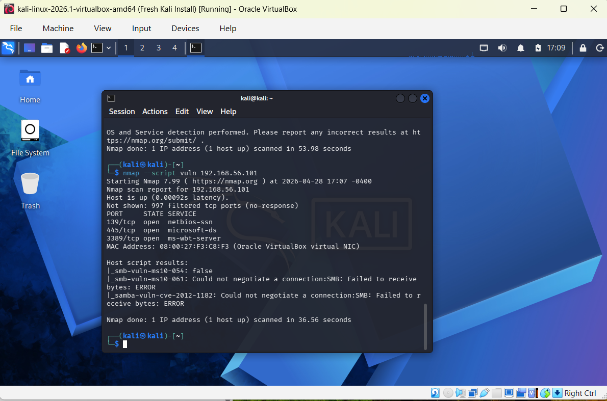

---

## SMB Access Attempt

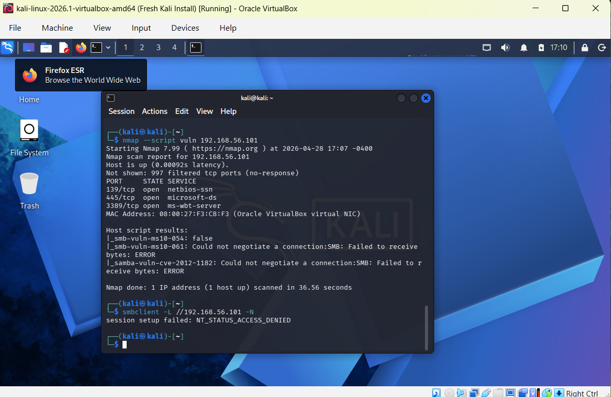

---

## SMB Enumeration

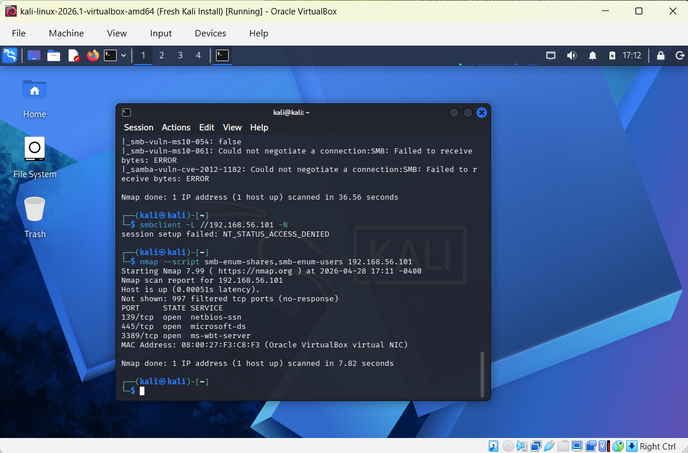

---

## Directory Listing Results

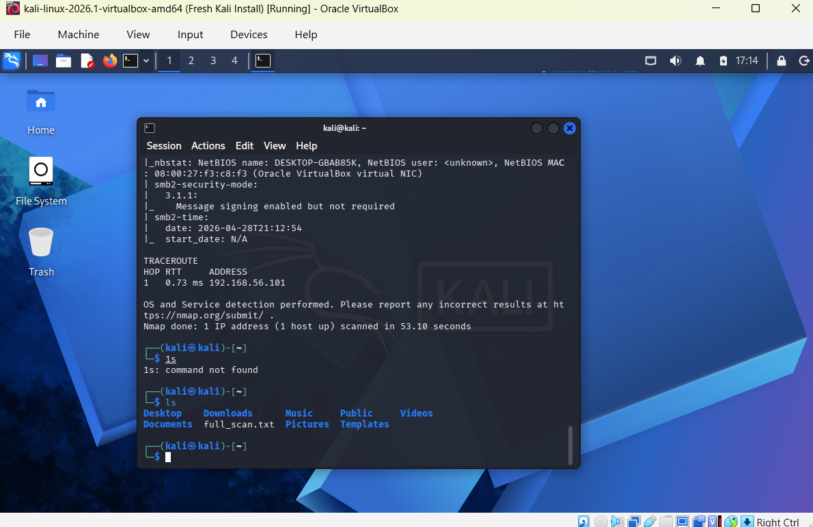

---

## Final Scan Output

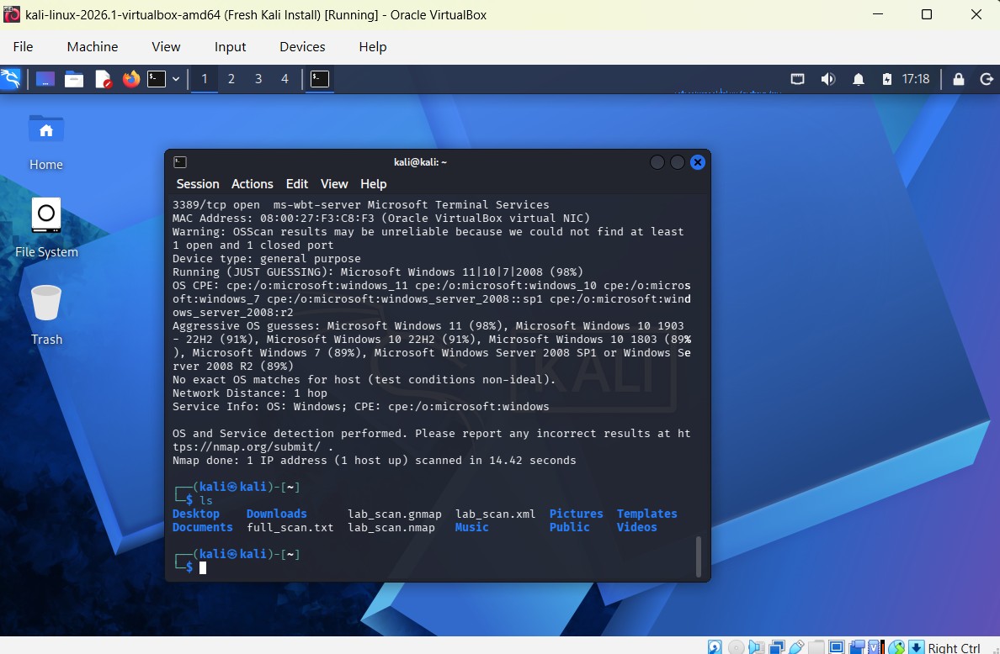

---

## File Organization & Lab Setup

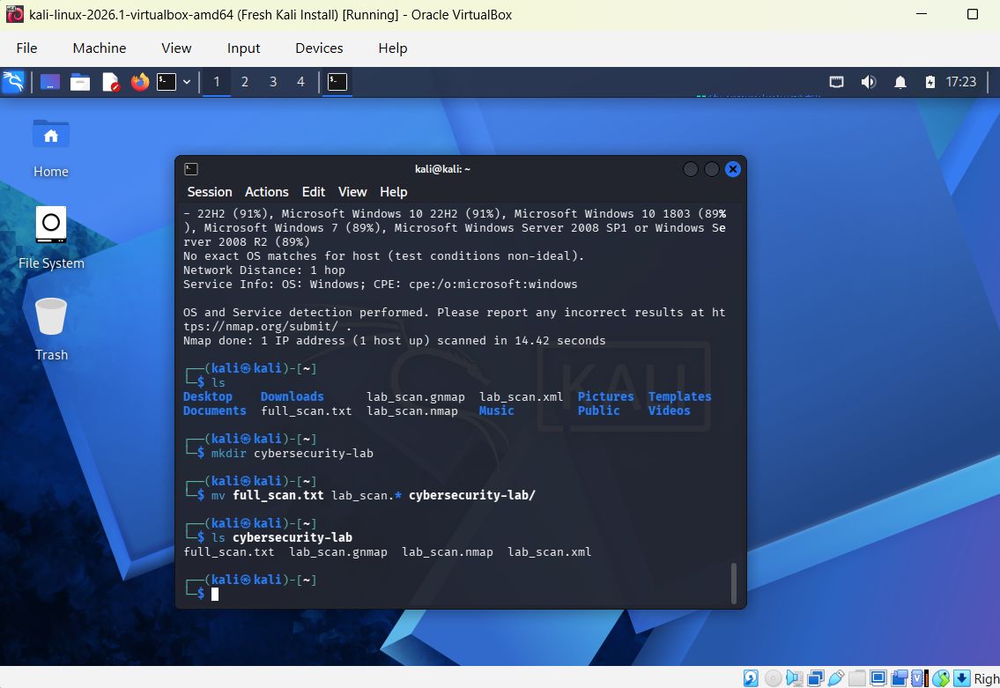
